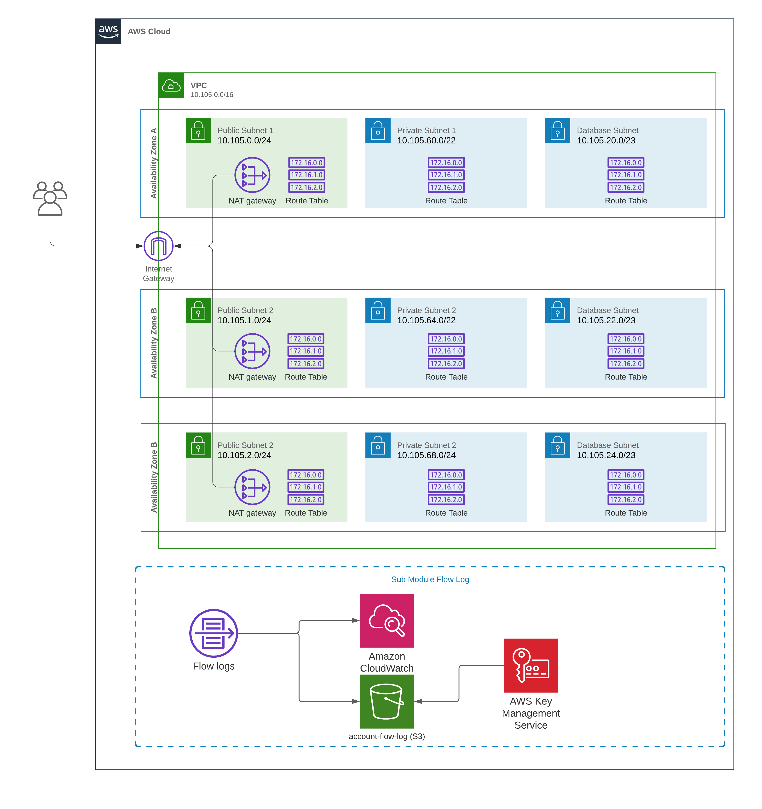

# AWS VPC Terraform Module

Terraform module with create vpc and subnet resources on AWS.



## Usage

### Hub account

```terraform
module "hub" {
  source = "<source>"

  prefix       = "oozou"
  environment  = "devops"
  account_mode = "hub"

  vpc_cidr           = "10.99.0.0/16"
  availability_zones = ["ap-southeast-1c", "ap-southeast-1b", "ap-southeast-1a"]
  public_subnets     = ["10.99.0.0/24", "10.99.1.0/24", "10.99.2.0/24"]
  private_subnets    = ["10.99.60.0/22", "10.99.64.0/22", "10.99.68.0/22"]
  database_subnets   = ["10.99.20.0/23", "10.99.22.0/23", "10.99.24.0/23"]

  is_create_nat_gateway             = true
  is_enable_single_nat_gateway      = true
  is_enable_dns_hostnames           = true
  is_enable_dns_support             = true
  is_create_flow_log                = true
  is_enable_flow_log_s3_integration = true

  spoke_account_ids = ["557291035691"]
  centralize_flow_log_bucket_lifecycle_rule = [
    {
      id = "FlowLogLifecyclePolicy"
      transition = [
        {
          days          = 31
          storage_class = "STANDARD_IA"
        },
        {
          days          = 366
          storage_class = "GLACIER"
        }
      ]
      expiration_days = 3660
    }
  ]

  tags = { "Workspace" = "xxx-yyy-zzz" }
}

module "spoke" {
  source = "<source>"

  prefix       = "oozou"
  environment  = "dev"
  account_mode = "spoke"

  vpc_cidr           = "10.100.0.0/16"
  availability_zones = ["ap-southeast-1c", "ap-southeast-1b", "ap-southeast-1a"]
  public_subnets     = ["10.100.0.0/24", "10.100.1.0/24", "10.100.2.0/24"]
  private_subnets    = ["10.100.60.0/22", "10.100.64.0/22", "10.100.68.0/22"]
  database_subnets   = ["10.100.20.0/23", "10.100.22.0/23", "10.100.24.0/23"]

  is_create_nat_gateway             = true
  is_enable_single_nat_gateway      = true
  is_enable_dns_hostnames           = true
  is_enable_dns_support             = true
  is_create_flow_log                = true
  is_enable_flow_log_s3_integration = true

  centralize_flow_log_bucket_name = module.hub.centralize_flow_log_bucket_name
  centralize_flow_log_kms_key_id  = module.hub.centralize_flow_log_key_arn

  tags = { "Workspace" = "xxx-yyy-zzz" }
}

module "spoke_without_everything" {
  source = "<source>"

  prefix       = "oozou"
  environment  = "dev"
  account_mode = "spoke"

  vpc_cidr           = "10.100.0.0/16"
  availability_zones = ["ap-southeast-1c", "ap-southeast-1b", "ap-southeast-1a"]
  public_subnets     = ["10.100.0.0/24", "10.100.1.0/24", "10.100.2.0/24"]
  private_subnets    = ["10.100.60.0/22", "10.100.64.0/22", "10.100.68.0/22"]
  database_subnets   = ["10.100.20.0/23", "10.100.22.0/23", "10.100.24.0/23"]

  is_create_nat_gateway             = true
  is_enable_single_nat_gateway      = true
  is_enable_dns_hostnames           = true
  is_enable_dns_support             = true
  is_create_flow_log                = false
  is_enable_flow_log_s3_integration = false

  tags = { "Workspace" = "xxx-yyy-zzz" }
}
```

<!-- BEGIN_TF_DOCS -->
## Requirements

| Name | Version |
|------|---------|
| <a name="requirement_terraform"></a> [terraform](#requirement\_terraform) | >= 1.0.0 |
| <a name="requirement_aws"></a> [aws](#requirement\_aws) | >= 4.00 |

## Providers

| Name | Version |
|------|---------|
| <a name="provider_aws"></a> [aws](#provider\_aws) | 4.31.0 |

## Modules

| Name | Source | Version |
|------|--------|---------|
| <a name="module_flow_log"></a> [flow\_log](#module\_flow\_log) | ./modules/flow-log | n/a |

## Resources

| Name | Type |
|------|------|
| [aws_default_security_group.this](https://registry.terraform.io/providers/hashicorp/aws/latest/docs/resources/default_security_group) | resource |
| [aws_eip.nat](https://registry.terraform.io/providers/hashicorp/aws/latest/docs/resources/eip) | resource |
| [aws_internet_gateway.this](https://registry.terraform.io/providers/hashicorp/aws/latest/docs/resources/internet_gateway) | resource |
| [aws_nat_gateway.nat](https://registry.terraform.io/providers/hashicorp/aws/latest/docs/resources/nat_gateway) | resource |
| [aws_nat_gateway.secondary_nat](https://registry.terraform.io/providers/hashicorp/aws/latest/docs/resources/nat_gateway) | resource |
| [aws_route.database_nat_gateway](https://registry.terraform.io/providers/hashicorp/aws/latest/docs/resources/route) | resource |
| [aws_route.database_nat_gateway_ipv6](https://registry.terraform.io/providers/hashicorp/aws/latest/docs/resources/route) | resource |
| [aws_route.private_nat_gateway](https://registry.terraform.io/providers/hashicorp/aws/latest/docs/resources/route) | resource |
| [aws_route.private_nat_gateway_ipv6](https://registry.terraform.io/providers/hashicorp/aws/latest/docs/resources/route) | resource |
| [aws_route.public_internet_gateway](https://registry.terraform.io/providers/hashicorp/aws/latest/docs/resources/route) | resource |
| [aws_route.public_internet_gateway_ipv6](https://registry.terraform.io/providers/hashicorp/aws/latest/docs/resources/route) | resource |
| [aws_route.secondary_nat_gateway](https://registry.terraform.io/providers/hashicorp/aws/latest/docs/resources/route) | resource |
| [aws_route.secondary_nat_gateway_ipv6](https://registry.terraform.io/providers/hashicorp/aws/latest/docs/resources/route) | resource |
| [aws_route_table.database](https://registry.terraform.io/providers/hashicorp/aws/latest/docs/resources/route_table) | resource |
| [aws_route_table.private](https://registry.terraform.io/providers/hashicorp/aws/latest/docs/resources/route_table) | resource |
| [aws_route_table.public](https://registry.terraform.io/providers/hashicorp/aws/latest/docs/resources/route_table) | resource |
| [aws_route_table.secondary](https://registry.terraform.io/providers/hashicorp/aws/latest/docs/resources/route_table) | resource |
| [aws_route_table_association.database](https://registry.terraform.io/providers/hashicorp/aws/latest/docs/resources/route_table_association) | resource |
| [aws_route_table_association.private](https://registry.terraform.io/providers/hashicorp/aws/latest/docs/resources/route_table_association) | resource |
| [aws_route_table_association.public](https://registry.terraform.io/providers/hashicorp/aws/latest/docs/resources/route_table_association) | resource |
| [aws_route_table_association.secondary](https://registry.terraform.io/providers/hashicorp/aws/latest/docs/resources/route_table_association) | resource |
| [aws_subnet.database](https://registry.terraform.io/providers/hashicorp/aws/latest/docs/resources/subnet) | resource |
| [aws_subnet.private](https://registry.terraform.io/providers/hashicorp/aws/latest/docs/resources/subnet) | resource |
| [aws_subnet.public](https://registry.terraform.io/providers/hashicorp/aws/latest/docs/resources/subnet) | resource |
| [aws_subnet.secondary](https://registry.terraform.io/providers/hashicorp/aws/latest/docs/resources/subnet) | resource |
| [aws_vpc.this](https://registry.terraform.io/providers/hashicorp/aws/latest/docs/resources/vpc) | resource |
| [aws_vpc_dhcp_options.this](https://registry.terraform.io/providers/hashicorp/aws/latest/docs/resources/vpc_dhcp_options) | resource |
| [aws_vpc_dhcp_options_association.this](https://registry.terraform.io/providers/hashicorp/aws/latest/docs/resources/vpc_dhcp_options_association) | resource |
| [aws_vpc_ipv4_cidr_block_association.secondary_cidr](https://registry.terraform.io/providers/hashicorp/aws/latest/docs/resources/vpc_ipv4_cidr_block_association) | resource |

## Inputs

| Name | Description | Type | Default | Required |
|------|-------------|------|---------|:--------:|
| <a name="input_account_mode"></a> [account\_mode](#input\_account\_mode) | Account mode for provision cloudtrail, if account\_mode is hub, will provision S3, KMS, CloudTrail. if account\_mode is spoke, will provision only CloudTrail | `string` | n/a | yes |
| <a name="input_availability_zone"></a> [availability\_zone](#input\_availability\_zone) | A list of availability zones names or ids in the region | `list(string)` | n/a | yes |
| <a name="input_cidr"></a> [cidr](#input\_cidr) | The CIDR block for the VPC | `string` | n/a | yes |
| <a name="input_environment"></a> [environment](#input\_environment) | Environment Variable used as a prefix | `string` | n/a | yes |
| <a name="input_prefix"></a> [prefix](#input\_prefix) | The prefix name of customer to be displayed in AWS console and resource | `string` | n/a | yes |
| <a name="input_private_subnets"></a> [private\_subnets](#input\_private\_subnets) | The CIDR block for the private subnets. | `list(string)` | n/a | yes |
| <a name="input_public_subnets"></a> [public\_subnets](#input\_public\_subnets) | The CIDR block for the public subnets. | `list(string)` | n/a | yes |
| <a name="input_centralize_flow_log_bucket_lifecycle_rule"></a> [centralize\_flow\_log\_bucket\_lifecycle\_rule](#input\_centralize\_flow\_log\_bucket\_lifecycle\_rule) | List of lifecycle rules to transition the data. Leave empty to disable this feature. storage\_class can be STANDARD\_IA, ONEZONE\_IA, INTELLIGENT\_TIERING, GLACIER, or DEEP\_ARCHIVE | <pre>list(object({<br>    id = string<br><br>    transition = list(object({<br>      days          = number<br>      storage_class = string<br>    }))<br><br>    expiration_days = number<br>  }))</pre> | `[]` | no |
| <a name="input_centralize_flow_log_bucket_name"></a> [centralize\_flow\_log\_bucket\_name](#input\_centralize\_flow\_log\_bucket\_name) | S3 bucket for store Cloudtrail log (long terms), leave this default if account\_mode is hub. If account\_mode is spoke, please provide centrailize flow log S3 bucket name (hub). | `string` | `""` | no |
| <a name="input_centralize_flow_log_kms_key_id"></a> [centralize\_flow\_log\_kms\_key\_id](#input\_centralize\_flow\_log\_kms\_key\_id) | The ARN for the KMS encryption key. Leave this default if account\_mode is hub. If account\_mode is spoke, please provide centrailize kms key arn (hub). | `string` | `""` | no |
| <a name="input_database_subnets"></a> [database\_subnets](#input\_database\_subnets) | The CIDR block for the database subnets. | `list(string)` | `[]` | no |
| <a name="input_dhcp_options_domain_name"></a> [dhcp\_options\_domain\_name](#input\_dhcp\_options\_domain\_name) | Specifies DNS name for DHCP options set (requires enable\_dhcp\_options set to true) | `string` | `""` | no |
| <a name="input_dhcp_options_domain_name_servers"></a> [dhcp\_options\_domain\_name\_servers](#input\_dhcp\_options\_domain\_name\_servers) | Specify a list of DNS server addresses for DHCP options set, default to AWS provided (requires enable\_dhcp\_options set to true) | `list(string)` | <pre>[<br>  "AmazonProvidedDNS"<br>]</pre> | no |
| <a name="input_dhcp_options_netbios_name_servers"></a> [dhcp\_options\_netbios\_name\_servers](#input\_dhcp\_options\_netbios\_name\_servers) | Specify a list of netbios servers for DHCP options set (requires enable\_dhcp\_options set to true) | `list(string)` | `[]` | no |
| <a name="input_dhcp_options_netbios_node_type"></a> [dhcp\_options\_netbios\_node\_type](#input\_dhcp\_options\_netbios\_node\_type) | Specify netbios node\_type for DHCP options set (requires enable\_dhcp\_options set to true) | `string` | `""` | no |
| <a name="input_dhcp_options_ntp_servers"></a> [dhcp\_options\_ntp\_servers](#input\_dhcp\_options\_ntp\_servers) | Specify a list of NTP servers for DHCP options set (requires enable\_dhcp\_options set to true) | `list(string)` | `[]` | no |
| <a name="input_flow_log_retention_in_days"></a> [flow\_log\_retention\_in\_days](#input\_flow\_log\_retention\_in\_days) | Specifies the number of days you want to retain log events in the specified log group for VPC flow logs. | `number` | `90` | no |
| <a name="input_instance_tenancy"></a> [instance\_tenancy](#input\_instance\_tenancy) | A tenancy option for instances launched into the VPC | `string` | `"default"` | no |
| <a name="input_is_create_database_subnet_route_table"></a> [is\_create\_database\_subnet\_route\_table](#input\_is\_create\_database\_subnet\_route\_table) | Whether to create database subnet or not | `bool` | `true` | no |
| <a name="input_is_create_flow_log"></a> [is\_create\_flow\_log](#input\_is\_create\_flow\_log) | Whether to create flow log. | `bool` | `true` | no |
| <a name="input_is_create_internet_gateway"></a> [is\_create\_internet\_gateway](#input\_is\_create\_internet\_gateway) | Whether to create igw or not | `bool` | `true` | no |
| <a name="input_is_create_nat_gateway"></a> [is\_create\_nat\_gateway](#input\_is\_create\_nat\_gateway) | Whether to create nat gatewat or not | `bool` | `false` | no |
| <a name="input_is_create_secondary_nat_gateway"></a> [is\_create\_secondary\_nat\_gateway](#input\_is\_create\_secondary\_nat\_gateway) | Whether to create private secondary nat gatewat or not | `bool` | `false` | no |
| <a name="input_is_create_vpc"></a> [is\_create\_vpc](#input\_is\_create\_vpc) | Whether to create vpc or not | `bool` | `true` | no |
| <a name="input_is_enable_dhcp_options"></a> [is\_enable\_dhcp\_options](#input\_is\_enable\_dhcp\_options) | Should be true if you want to specify a DHCP options set with a custom domain name, DNS servers, NTP servers, netbios servers, and/or netbios server type | `bool` | `false` | no |
| <a name="input_is_enable_dns_hostnames"></a> [is\_enable\_dns\_hostnames](#input\_is\_enable\_dns\_hostnames) | Should be true to enable DNS hostnames in the VPC | `bool` | `false` | no |
| <a name="input_is_enable_dns_support"></a> [is\_enable\_dns\_support](#input\_is\_enable\_dns\_support) | Should be true to enable DNS support in the VPC | `bool` | `true` | no |
| <a name="input_is_enable_eks_auto_discovery"></a> [is\_enable\_eks\_auto\_discovery](#input\_is\_enable\_eks\_auto\_discovery) | Tags public, private subnet to auto discovery | `bool` | `true` | no |
| <a name="input_is_enable_flow_log_s3_integration"></a> [is\_enable\_flow\_log\_s3\_integration](#input\_is\_enable\_flow\_log\_s3\_integration) | Whether to enable flow log S3 integration. | `bool` | `true` | no |
| <a name="input_is_enable_ipv6"></a> [is\_enable\_ipv6](#input\_is\_enable\_ipv6) | Requests an Amazon-provided IPv6 CIDR block with a /56 prefix length for the VPC. You cannot specify the range of IP addresses, or the size of the CIDR block. | `bool` | `false` | no |
| <a name="input_is_enable_single_nat_gateway"></a> [is\_enable\_single\_nat\_gateway](#input\_is\_enable\_single\_nat\_gateway) | Should be true if you want to provision a single shared NAT Gateway across all of your private networks | `bool` | `false` | no |
| <a name="input_is_map_public_ip_on_launch_public_subnet"></a> [is\_map\_public\_ip\_on\_launch\_public\_subnet](#input\_is\_map\_public\_ip\_on\_launch\_public\_subnet) | Specify true to indicate that instances launched into public subnets will be assigned a public IP address | `bool` | `false` | no |
| <a name="input_is_one_nat_gateway_per_az"></a> [is\_one\_nat\_gateway\_per\_az](#input\_is\_one\_nat\_gateway\_per\_az) | Enable multiple Nat gateway and public subnets with Multi-AZ | `bool` | `false` | no |
| <a name="input_secondary_cidr"></a> [secondary\_cidr](#input\_secondary\_cidr) | The Secondary CIDR block for the VPC | `string` | `""` | no |
| <a name="input_secondary_subnets"></a> [secondary\_subnets](#input\_secondary\_subnets) | The CIDR block for the secondary subnets. | `list(string)` | `[]` | no |
| <a name="input_spoke_account_ids"></a> [spoke\_account\_ids](#input\_spoke\_account\_ids) | Spoke account Ids, if mode is hub. | `list(string)` | `[]` | no |
| <a name="input_tags"></a> [tags](#input\_tags) | Tags to add more; default tags contian {terraform=true, environment=var.environment} | `map(string)` | `{}` | no |

## Outputs

| Name | Description |
|------|-------------|
| <a name="output_centralize_flow_log_bucket_arn"></a> [centralize\_flow\_log\_bucket\_arn](#output\_centralize\_flow\_log\_bucket\_arn) | S3 Centralize Flow log Bucket ARN |
| <a name="output_centralize_flow_log_bucket_name"></a> [centralize\_flow\_log\_bucket\_name](#output\_centralize\_flow\_log\_bucket\_name) | S3 Centralize Flow log Bucket Name |
| <a name="output_centralize_flow_log_key_arn"></a> [centralize\_flow\_log\_key\_arn](#output\_centralize\_flow\_log\_key\_arn) | KMS Centralize Flow log key arn |
| <a name="output_centralize_flow_log_key_id"></a> [centralize\_flow\_log\_key\_id](#output\_centralize\_flow\_log\_key\_id) | KMS Centralize Flow log key id |
| <a name="output_database_subnet_arns"></a> [database\_subnet\_arns](#output\_database\_subnet\_arns) | List of ARNs of database subnets |
| <a name="output_database_subnet_cidr_blocks"></a> [database\_subnet\_cidr\_blocks](#output\_database\_subnet\_cidr\_blocks) | List of cidr\_blocks of database subnets |
| <a name="output_database_subnet_ids"></a> [database\_subnet\_ids](#output\_database\_subnet\_ids) | List of IDs of database subnets |
| <a name="output_database_subnet_ipv6_cidr_blocks"></a> [database\_subnet\_ipv6\_cidr\_blocks](#output\_database\_subnet\_ipv6\_cidr\_blocks) | List of IPv6 cidr\_blocks of database subnets in an IPv6 enabled VPC |
| <a name="output_default_security_gruop_id"></a> [default\_security\_gruop\_id](#output\_default\_security\_gruop\_id) | The ID of the security group created by default on VPC creation |
| <a name="output_flow_log_cloudwatch_dest_arn"></a> [flow\_log\_cloudwatch\_dest\_arn](#output\_flow\_log\_cloudwatch\_dest\_arn) | Flow log CloudWatch ARN |
| <a name="output_flow_log_cloudwatch_dest_id"></a> [flow\_log\_cloudwatch\_dest\_id](#output\_flow\_log\_cloudwatch\_dest\_id) | Flow log CloudWatch Id |
| <a name="output_flow_log_s3_dest_arn"></a> [flow\_log\_s3\_dest\_arn](#output\_flow\_log\_s3\_dest\_arn) | Flow log S3 ARN |
| <a name="output_flow_log_s3_dest_id"></a> [flow\_log\_s3\_dest\_id](#output\_flow\_log\_s3\_dest\_id) | Flow log S3 Id |
| <a name="output_igw_arn"></a> [igw\_arn](#output\_igw\_arn) | The ARN of the Internet Gateway |
| <a name="output_igw_id"></a> [igw\_id](#output\_igw\_id) | The ARN of the Internet Gateway |
| <a name="output_natgw_ids"></a> [natgw\_ids](#output\_natgw\_ids) | List of NAT Gateway IDs |
| <a name="output_private_subnet_arns"></a> [private\_subnet\_arns](#output\_private\_subnet\_arns) | List of ARNs of private subnets |
| <a name="output_private_subnet_cidrs_blocks"></a> [private\_subnet\_cidrs\_blocks](#output\_private\_subnet\_cidrs\_blocks) | List if cidr\_blocks of private subnets |
| <a name="output_private_subnet_ids"></a> [private\_subnet\_ids](#output\_private\_subnet\_ids) | List of IDs of private subnets |
| <a name="output_private_subnet_ipv6_cidr_blocks"></a> [private\_subnet\_ipv6\_cidr\_blocks](#output\_private\_subnet\_ipv6\_cidr\_blocks) | List of IPv6 cidr\_blocks of private subnets in an IPv6 enabled VPC |
| <a name="output_public_subnet_arns"></a> [public\_subnet\_arns](#output\_public\_subnet\_arns) | List of ARNs of public subnets |
| <a name="output_public_subnet_cidrs_blocks"></a> [public\_subnet\_cidrs\_blocks](#output\_public\_subnet\_cidrs\_blocks) | List if cidr\_blocks of public subnets |
| <a name="output_public_subnet_ids"></a> [public\_subnet\_ids](#output\_public\_subnet\_ids) | List of IDs of public subnets |
| <a name="output_public_subnet_ipv6_cidr_blocks"></a> [public\_subnet\_ipv6\_cidr\_blocks](#output\_public\_subnet\_ipv6\_cidr\_blocks) | List of IPv6 cidr\_blocks of public subnets in an IPv6 enabled VPC |
| <a name="output_secondary_natgw_ids"></a> [secondary\_natgw\_ids](#output\_secondary\_natgw\_ids) | List of Secondary NAT Gateway IDs |
| <a name="output_secondary_subnet_arns"></a> [secondary\_subnet\_arns](#output\_secondary\_subnet\_arns) | List of ARNs of secondary subnets |
| <a name="output_secondary_subnet_cidrs_blocks"></a> [secondary\_subnet\_cidrs\_blocks](#output\_secondary\_subnet\_cidrs\_blocks) | List if cidr\_blocks of secondary subnets |
| <a name="output_secondary_subnet_ids"></a> [secondary\_subnet\_ids](#output\_secondary\_subnet\_ids) | List of IDs of secondary subnets |
| <a name="output_secondary_subnet_ipv6_cidr_blocks"></a> [secondary\_subnet\_ipv6\_cidr\_blocks](#output\_secondary\_subnet\_ipv6\_cidr\_blocks) | List of IPv6 cidr\_blocks of secondary subnets in an IPv6 enabled VPC |
| <a name="output_secondary_vpc_cidr_block"></a> [secondary\_vpc\_cidr\_block](#output\_secondary\_vpc\_cidr\_block) | The CIDR block of the VPC |
| <a name="output_vpc_arn"></a> [vpc\_arn](#output\_vpc\_arn) | The ARN of the VPC |
| <a name="output_vpc_cidr_block"></a> [vpc\_cidr\_block](#output\_vpc\_cidr\_block) | The CIDR block of the VPC |
| <a name="output_vpc_id"></a> [vpc\_id](#output\_vpc\_id) | The ID of the VPC |
<!-- END_TF_DOCS -->
